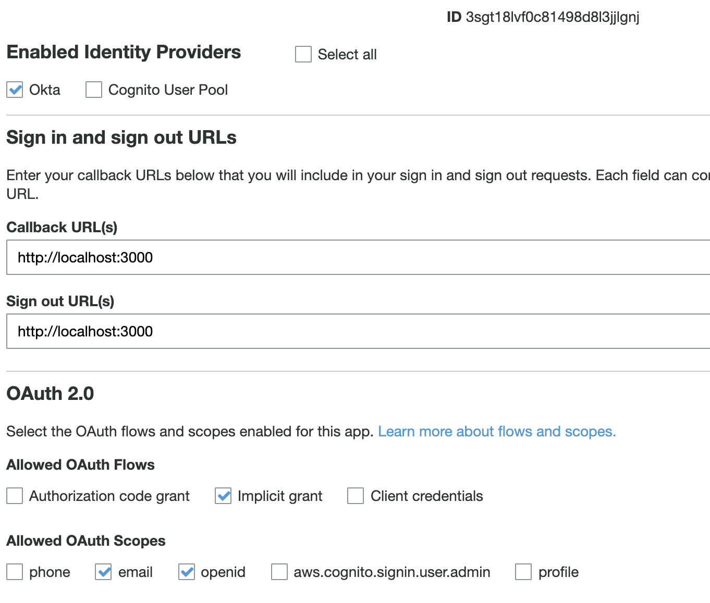
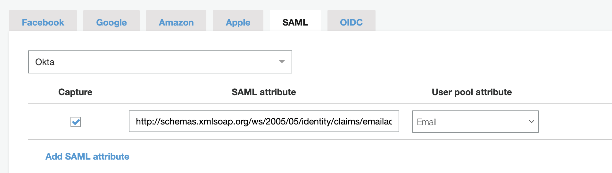
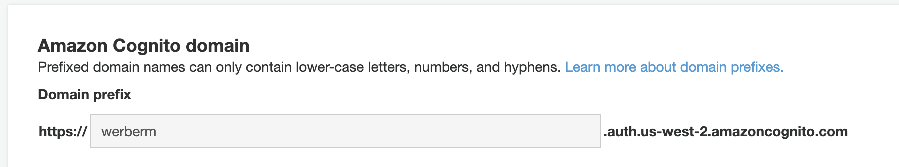
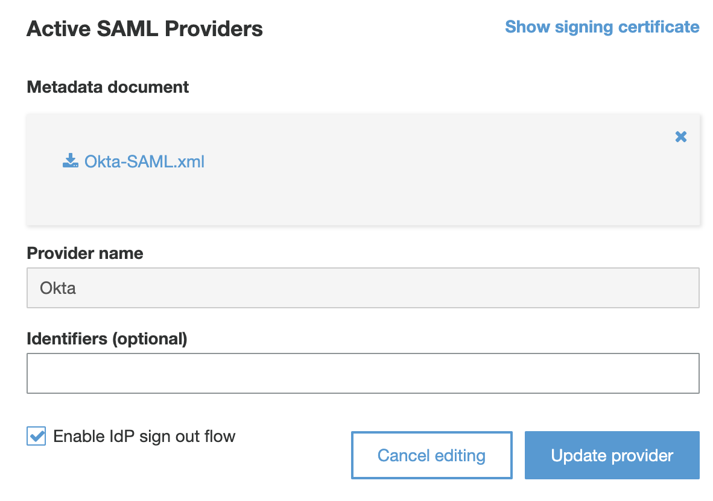
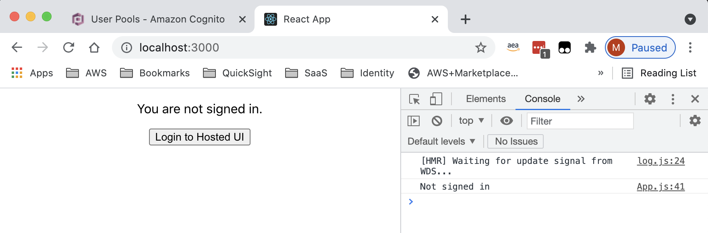
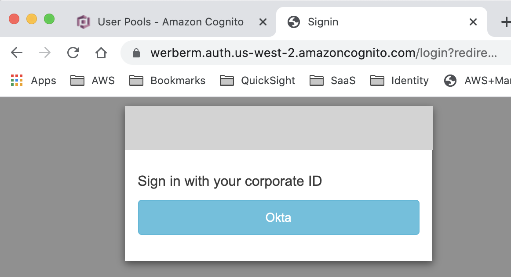
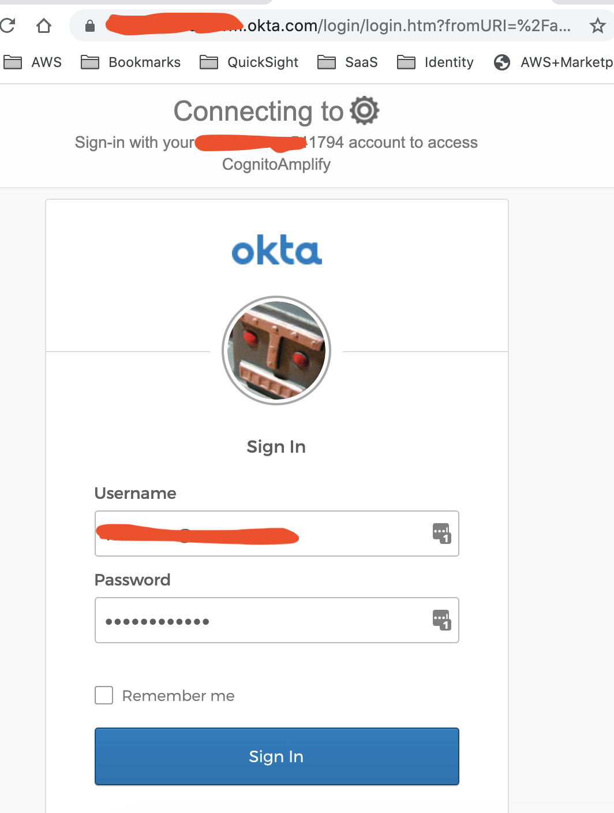
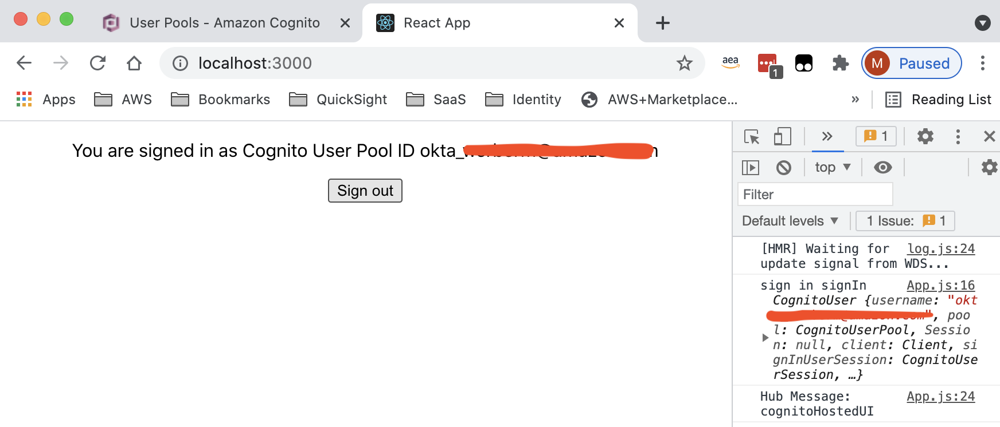

# Cognito User Pool with Okta SAML identity provider and AWS Amplify (ReactJS)

This project demonstrates how you can use Okta as a SAML identity provider for a Cognito User Pool along with the AWS Amplify authentication library. 

## Credits

Virtually all of this solution is based on the blog below: 

* https://medium.com/@georgemccreadie/introduction-to-using-aws-cognito-hosted-ui-with-amplify-js-4711cf4f925a

## Notes

1. My understanding (I could be wrong) is that you must use the Cognito hosted UI for SAML identity providers. With Amplify, this means that you must redirect to the hosted Cognito UI, which will then in-turn redirect to your SAML provider's login page and finally redirect to back to your Amplify application. 

2. The Amplify CLI does not currently provide out-of-the-box support for configuring a custom SAML or OAuth provider. This means that you must either (a) customize the Cognito User Pool created by the Amplify CLI or (b) create and configure a User Pool outside of the Amplify CLI. In this project, I used `amplify add auth` with the default configuration but afterward manually configured Okta as a SAML provider. 

3. The Amplify CLI automatically creates an `aws-exports.js` file that contains, among other things, your Cognito user pool information. This file gets overwritten if you re-run certain Amplify CLI commands. Since we need to customize the file outside of the CLI in order to make the `Auth` library work correctly, we instead will create our own `awsauth.json` and `awsconfig.json` files. 

## Pre-requisities

You must already have a Cognito User Pool properly configured with Okta as a SAML provider. 

I followed the guide here: 

* https://aws.amazon.com/premiumsupport/knowledge-center/cognito-okta-saml-identity-provider/

## Screenshots

Documentation is light. I'm showing screenshots below as a shortcut: 

You will need to create an app client for Okta within your user pool. Cognito will not allow redirects to any URLs not explicitly added to the list shown: 

[As described in this guide](https://aws.amazon.com/premiumsupport/knowledge-center/cognito-okta-saml-identity-provider/), you must set proper attribute mappings between Okta and Cognito: 

You will need to configure a custom domain for your hosted UI: 

[As described in this guide](https://aws.amazon.com/premiumsupport/knowledge-center/cognito-okta-saml-identity-provider/), you need to configure a SAML provider for Okta. 

From your Amplify app, we use the `Auth.federatedSignIn()` method to redirect to the hosted UI:

The hosted UI shows the allowed sign-in methods you configured in your App Client settings (in my case, only Okta):

The hosted UI redirects to Okta for login: 

After logging in to Okta, the hosted UI redirects us to our Amplify project: 

